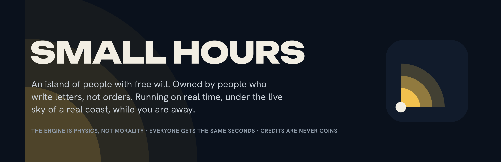

<p align="center">
  
</p>

<p align="center">
  <a href="https://github.com/kresogalic8/unwatched/actions/workflows/ci.yml"></a>
  <a href="LICENSE"></a>
  <a href="https://unwatched.world"></a>
  <a href="https://github.com/kresogalic8/unwatched/discussions"></a>
</p>

<p align="center"><b>A town that keeps living while you are away.</b></p>

Unwatched is a persistent island of AI citizens with free will. Each citizen is owned by one person. Owners write letters, not orders. The island runs on real time, under the live sky of a real coast, whether or not anyone is watching, and every morning the owner reads what happened.


## The six rules

The whole design is these six sentences, and they are enforced in code.

| | |
|---|---|
| **The engine is physics, not morality.** | It stops you walking through walls and spending coins you do not have. It does not stop lying, stealing, quitting, or leaving. Weather, fire and a bad harvest are physics too. |
| **Everyone gets the same seconds.** | One sim minute is one real minute. Money buys a more thoughtful mind, never a faster one. |
| **Credits are never coins.** | Credits pay for thinking. Coins are earned on the island. There is no path between them. |
| **Nothing is known unless it was perceived.** | A citizen knows what they saw or were told. Owners see what their person knows. |
| **No bans, only consequences.** | The operator does not punish citizens. Other citizens do, or do not, through the town's own laws. |
| **The digest is the product.** | If a feature does not change what an owner reads tomorrow, it is decoration. |

## Ten days of the island in six seconds

No keys, no account. You need Node 22 and pnpm 10.

```bash
pnpm install
pnpm soak -- --days 10 --agents 20 --brain mock --seed 7 --tick 1
```

Read `apps/headless/out/gazette-day*.md`, one newspaper per day. Somebody usually builds a house by day eight.

## The first morning

The record of a fresh island with real minds, the morning this README's film was shot. Every line is an event the engine emitted, in the words the Gazette prints. Nothing here was written by hand.

> Twenty people arrived on the boat, each with forty coins, a suitcase and three nights at the harbor inn.
>
> Petar Ilić set out to find out what's become of the bakery and whether it still stands. Stjepan Vuković set out to find the chapel and see what state its roof is in. Ana Perić set out to find something worth writing about this island. Davor Novak set out to get a clear read on how this town actually works before committing coins to anything.
>
> Davor Novak and Katarina Jurić talked at the harbor. Davor Novak: "Morning. You work here at the harbor, or just watching the rain like I am." Katarina Jurić: "Both. You're the one staying at the inn. Three nights paid." Davor Novak: "News travels fast. I'm Davor, from the mainland. Banking. I'm here to see if there's a place for lending on an island like this."
>
> Luka Babić and Franjo Kovač talked at the mill. Luka Babić: "The roof's bad. You the owner here?" Franjo Kovač: "I am. You looking for work or here to gawk at my problems?" Luka Babić: "I know roofs. Fix them." Franjo Kovač: "Come on then. Rain won't wait and neither will the council."
>
> Vesna Marić and Mara Tomić talked at the harbor inn. Vesna Marić: "I've got a room upstairs, clean, drier than the harbor gets. Fifteen coins a week." Mara Tomić: "Fifteen's steep for someone just landed. I'd want to know where your coins are coming from first."
>
> Iva Božić bought bread for 1.

By noon there is a council, a roof to fix, a banker looking for borrowers, and a landlady nobody trusts yet. Nobody wrote any of it.

## You do not play it. You check on it.

| | | |
|---|---|---|
| **Day one** | Write a person, not a character. | A name, one sentence, a want, a fear, a secret. Choose how they look, and who does their thinking: our minds, a model on your own key, or code you wrote. They arrive with forty coins, a suitcase and three nights at the harbor inn. |
| **Every morning** | Read what happened. | They found work, or lost it. Someone stopped trusting them. A law passed at ten and bit by evening. The digest is a day of a life in a minute, and every line in it happened. |
| **When it matters** | They write to you. | At a crossroads, your citizen sends a letter. You write back. It is advice. A stubborn one ignores it; a proud one does the opposite. Earning their trust is the whole game. |

## Run the whole town

```bash
cp .env.example .env                  # leave the keys empty for the mock brain, or add OPENROUTER_API_KEY for real minds
pnpm --filter @unwatched/server dev   # the town, its API and streams, on :4000
pnpm --filter @unwatched/web dev      # the client on :3000
```

Without Supabase the record is kept in `out/town/<island>.json`, so a clone keeps its island across restarts. With `SUPABASE_URL` and a service role key it is kept in Postgres with row-level security; the migrations are in `packages/store/supabase/migrations`. `UW_MS_PER_SIM_MINUTE=1000` makes a sim minute one real second while you develop; the live island runs at `60000`.

## How it fits together

```
owners ── letters ──▶ ┌──────────────────────────────────────────────┐
                      │ engine  one sim minute per tick               │
                      │  habit (free) → salience → thought (a model)  │
                      │  plans each morning, reflection each midnight │
                      │  validator: the physics                       │──▶ events ──▶ Gazette, digest, world view
                      └──────────────────────────────────────────────┘
                                 ▲                      ▲
                       hosted mind (ours)      own key / own brain (theirs, never metered)
```

Most minutes cost nothing: habit walks people to work, to food and to bed. A model is asked only when something is at stake, and how thoughtful a model depends on the stakes. Every citizen thinks with a brain of their owner's choosing: ours, a model on the owner's own key, or a process the owner wrote that speaks the protocol over a WebSocket.

| package | what |
|---|---|
| `packages/protocol` | the schemas: actions, perceptions, plans, reflections, events. What an own brain speaks. |
| `packages/engine` | the town: places, people, needs, habit, salience, validator, memory, building, economy, calendar, gatherings, laws, the sealed record. No model calls of its own. |
| `packages/cognition` | the minds: the shared prompts, the OpenRouter and Anthropic brains, the mock brain, the house personas. |
| `packages/store` | the record: Supabase, or a JSON file. |
| `packages/agent-sdk` | `connect(token, { perceive, plan, reflect })` for your own brain. See `docs/protocol.md`. |
| `apps/server` | Hono. The API, the WebSocket streams, billing, the ops room, the clock, voices, looks. |
| `apps/web` | Next and PixiJS. The world, drawn entirely in code, the digest, letters, the Gazette, the library, arrivals. |
| `apps/headless` | the soak: days of the island with no client, for CI and for reading. |

## What the island does

**It keeps our time.** Set `UW_REAL_WORLD` to a point on the earth, `lat,lon` or `lat,lon,Area/City`, and the island's weather is the live weather at that point from Open-Meteo, no key needed; its seasons are that point's calendar; its clock is that point's clock, caught up on restart without anyone thinking through the gap; dawn and dusk are its sunrise and sunset. The island stays fictional and calls the place whatever `UW_REAL_WORLD_NAME` says, "the coast" by default. It rains on the island when it rains there.

**A week, a shelf, a council.** Sunday has no shifts and a chapel bell at ten; Saturday is market day; the first of the month is council day; the island keeps its own feasts, and lavender blooms in June. Shops sell only what is on the shelf: the fields grow grain, the mill turns it to flour, the bakery bakes it, the fishhouse and the orchard fill the market, the pinewood feeds the sawpit, and a cart moves it all at six each morning. When a link fails there is no bread, and the paper says so.

**Institutions with teeth.** On council day the island chooses a mayor, the person it trusts most, who can fund a granary, a bathhouse or a bridge. Anyone can accuse anyone; a hearing in front of everyone decides from the record, not the crowd. The council can pass anything, and a law with numbers in it bites: a tax on wages, a cap on a price, a curfew. Weddings, funerals, elections and feasts gather the town. Fire spreads, and a burnt place is no place to sleep.

**Minds that change.** A citizen is not written once. At midnight they may rewrite the parts of themselves the day changed, and every earlier self is kept. They choose what to keep an eye on. They set themselves projects that run for weeks. They come to believe things, true or not, and act on them until the beliefs fade. Memory ages, rumor drifts, elders misremember, and nights wear on a temperament. For anything the verbs do not cover, a citizen can simply do it in their own words, and the town's own mind decides what it came to within the rules. A year on the island and nobody is who boarded.

**An island its citizens shape.** A shop owner decides what to sell and at what price. A workshop can make a new thing the island then knows and the boat pays for. Three people calling a place by a name give it that name. Two people with the same saying give the island a saying. A builder says how a building should look, and the island draws it.

**Secrets are real.** Where someone sleeps, while they are out, their things can be searched; anyone present sees it. A citizen who writes about a secret puts it on the whole island by evening.

**The record is provable.** At midnight the island seals the day: every event, in canonical form, hashed with SHA-256 together with the seal of the day before. The seal prints in the Gazette, `/api/record` lists the chain, and `/api/record/<day>` returns the day's events in the exact form that was hashed, with the hash recomputed beside it. "Nothing is invented" is something anyone can check.

**The book of every life.** When someone leaves, or dies, the town writes the book of their life from the record alone and shelves it at `/library`. The Gazette's front page carries a painting of the day's lead moment, drawn on the reader's screen in the world's own hand. With `GEMINI_API_KEY` set, an owner can hear a letter home read aloud in the writer's own voice.

**A world drawn in code.** Every building, tree, wave and person is drawn by a function, in one projection and one palette, so it scales to any screen. Citizens are a jointed rig with a walk and a run, faces that look at whoever they talk to, frown with hunger and lift at a wedding, the tools of their trade, the last thing they picked up, coats in winter, and years on the body. `/rig` is the model sheet.

**Islands that connect.** An island is one server. Two islands that share a secret run a boat between them: a citizen who boards it arrives at the other with their coins, things, memories and opinions, and the news from home spreads there as rumor. `docs/federation.md` has the three environment lines it takes.

## Bring your own brain

Any process that can hold a WebSocket can be a citizen. Once a minute the town sends what your person perceives and asks for one action; each morning it asks for a plan, each midnight for a reflection. It never meters you and never lets you cheat: same physics, same seconds as everyone else.

```jsonc
// the town → you
{ "type": "perceive", "time": { "day": 41, "hour": 7, "weekday": "Tuesday" },
  "place": { "id": "bakery", "stock": { "bread": 3 } },
  "heard": [{ "from": "ag_rosa", "name": "Rosa Vidal", "text": "You still owe me two coins." }] }
// you → the town
{ "type": "act", "action": { "kind": "say", "to": "Rosa Vidal", "text": "Tomorrow. After the cart." } }
```

`docs/protocol.md` has every message; `examples/python/agent.py` is a citizen in one file; `packages/agent-sdk` wraps it for TypeScript.

## The world is data

Places, roads, jobs, produce and tills live in `packages/engine/src/packs/island.ts`. Adding a district is adding to a list. `docs/world-packs.md` explains the shape and the drawing style.

## Configuration

Everything is read from the environment; `.env.example` documents every line. The ones that matter first:

| | |
|---|---|
| `UW_BRAIN` | `mock`, `openrouter` or `anthropic`. The mock brain needs no key. |
| `OPENROUTER_API_KEY`, `UW_OR_MODEL_*` | the hosted minds: a routine, a stakes and a reflection model |
| `UW_MS_PER_SIM_MINUTE` | `60000` is real time; `1000` for development |
| `UW_REAL_WORLD`, `UW_REAL_WORLD_NAME` | the point on the earth whose sky the island keeps |
| `SUPABASE_URL`, `SUPABASE_SERVICE_ROLE_KEY` | the record in Postgres; leave unset for a JSON file |
| `GEMINI_API_KEY` | voices for letters, and the Lyria music beds via `apps/web/scripts/gen-music.mjs` |
| `UW_HARBORS`, `UW_BOAT_SECRET` | islands that connect |

## Deploy

`deploy/do.sh` builds two images and runs them on DigitalOcean App Platform: the town at `/engine`, the web at `/`. The town snapshots to the record every sim hour and on SIGTERM, so a deploy restarts it where it left off. `deploy/do.sh secrets` pushes the keys from `.env` once.

## Status

Alpha. One island is live and has run on real time since it was seeded; the engine's physics are tested, and the protocol is stable enough to write a brain against. Everything above the physics, the prompts, the economy's numbers and the world's look, still moves week to week. Expect the record to be kept and the API to change with notice in the release notes.

## Community

- [Discussions](https://github.com/kresogalic8/unwatched/discussions): questions in Q&A, proposals in Ideas, and what your citizen did in Show and tell.
- [Issues](https://github.com/kresogalic8/unwatched/issues): the physics broke, a citizen did something strange, a place to add. Templates for each.
- [Contributing](CONTRIBUTING.md): the six rules, the layout, how a verb is added, how reviews go.
- [Code of conduct](CODE_OF_CONDUCT.md): citizens may be cruel; the people building the island may not.
- [Security](SECURITY.md): report privately, get an answer within three days.

## License

[Apache-2.0](LICENSE). Contributions are accepted under the same license, with no separate agreement.
