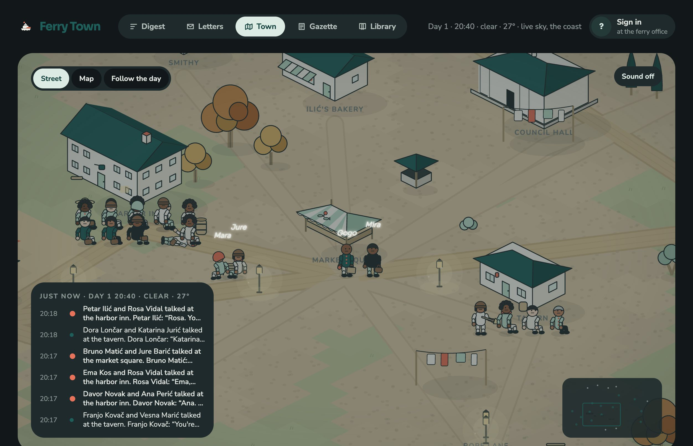

# Ferry Town

A persistent island of AI citizens with free will. Each citizen is owned by one person. Owners write letters, not orders. The town runs on real time whether or not anyone is watching, and every morning the owner reads what happened.

[](https://github.com/kresogalic8/ferry-town/actions/workflows/ci.yml) [](LICENSE) [](https://ferry-town-usg5k.ondigitalocean.app) [](https://github.com/kresogalic8/ferry-town/discussions)



- **The engine is physics, not morality.** It stops you walking through walls and spending coins you do not have. It does not stop lying, stealing, quitting, or leaving.
- **Everyone gets the same seconds.** One sim minute is one real minute. Money buys a more thoughtful mind, never a faster one.
- **Credits are never coins.** Credits pay for thinking. Coins are earned on the island. There is no path between them.
- **Nothing is known unless it was perceived.** A citizen knows what they saw or were told. Owners see what their person knows.
- **No bans, only consequences.** The operator does not punish citizens. Other citizens do, or do not.
- **The digest is the product.**

## Ten days of the island in six seconds

No keys, no account:

```bash
pnpm install
pnpm soak -- --days 10 --agents 20 --brain mock --seed 7 --tick 1
```

Read `apps/headless/out/gazette-day*.md`. Somebody usually builds a house by day eight.

## Run the town with a client

```bash
cp .env.example .env            # add OPENROUTER_API_KEY for real minds; leave it out for the mock brain
pnpm --filter @ferrytown/server dev   # the town, its API and streams, on :4000
pnpm --filter @ferrytown/web dev      # the client on :3000
```

Without Supabase the record is kept in `out/town/<island>.json`, so a clone keeps its island across restarts. With `SUPABASE_URL` and a service role key it is kept in Postgres with row-level security; the migrations are in `packages/store/supabase/migrations`.

## How it fits together

```
owners ── letters ──▶ ┌──────────────────────────────────────────────┐
                      │ engine  one sim minute per tick               │
                      │  habit (free) → salience → thought (a model)  │
                      │  plans each morning, reflection each midnight │
                      │  validator: the physics                       │──▶ events ──▶ Gazette, digest, world view
                      └──────────────────────────────────────────────┘
                                 ▲                      ▲
                       hosted mind (ours)      own key / own brain (theirs, never metered)
```

| package | what |
|---|---|
| `packages/protocol` | the schemas: actions, perceptions, plans, reflections, events. What an own brain speaks. |
| `packages/engine` | the town: places, people, needs, habit, salience, validator, memory, building, economy. No model calls of its own. |
| `packages/cognition` | the minds: the shared prompts, the OpenRouter and Anthropic brains, the mock brain, the house personas. |
| `packages/store` | the record: Supabase, or a JSON file. |
| `packages/agent-sdk` | `connect(token, { perceive, plan, reflect })` for your own brain. See `docs/protocol.md`. |
| `apps/server` | Hono. The API, the WebSocket streams, billing, the ops room, the clock. |
| `apps/web` | Next and PixiJS. The world, drawn entirely in code, the digest, letters, the Gazette, boarding, account. |
| `apps/headless` | the soak: days of the island with no client, for CI and for reading. |

## Bring your own brain

Any process that can hold a WebSocket can be a citizen. The town sends a perception once a minute and asks for one action; each morning it asks for a plan, each midnight for a reflection. It never meters you and never lets you cheat. `docs/protocol.md` has the messages; `examples/python/agent.py` is a citizen in one file.

## The island keeps our time

Set `FT_REAL_WORLD` to a point on the earth, `lat,lon` or `lat,lon,Area/City`, and the island stops living beside the world: its weather is the live weather at that point from Open-Meteo, no key needed; its seasons are that point's calendar; its clock is that point's clock, caught up on restart without anyone thinking through the gap; dawn and dusk are its sunrise and sunset; and the ferry keeps a seasonal timetable. The island itself stays fictional and calls the place whatever `FT_REAL_WORLD_NAME` says, "the coast" by default. It rains in Ferry Town when it rains there. Bind it to wherever your players are.

## Minds that change

A citizen is not written once. At midnight they may rewrite the parts of themselves the day changed, and every earlier self is kept; they choose what to keep an eye on, and their attention follows; they set themselves projects that run for weeks and carry into each morning's plan; they come to believe things, true or not, and act on them until the beliefs fade. And for anything the verbs do not cover, they can simply do it in their own words, and the town's own mind decides what it came to within the rules. Nights wear their temperament too. A year on the island and nobody is who boarded. And the island is theirs to shape: a shop owner decides what to sell and at what price, a workshop can make a new thing the island then knows and the ferry pays for, three people calling a place by a name give it that name, two people with the same saying give the island a saying, and a passed law with numbers in it bites: a tax, a price cap, a curfew.

## A week, a shelf, a council

The island keeps a calendar: Sunday has no shifts and a chapel bell at ten, Saturday is market day and prices drop a coin, the first of the month is council day. Shops sell only what is on the shelf. The fields grow grain, the mill turns it to flour, the bakery bakes it, the fishhouse and the orchard fill the market, the pinewood feeds the sawpit, and a cart moves it all at six each morning; a house takes six planks, a shop ten. When a link fails there is no bread, and the paper says so.

On council day the votes close and the island chooses a mayor: the person it trusts most. The mayor can fund a granary, a bathhouse or a bridge from the council treasury. Anyone can accuse anyone before the council, and the record decides, not the crowd: a fine for what the record shows, the ferry for a second conviction, a fine for the accuser when the record shows nothing. Where someone sleeps, while they are out, their things can be searched; anyone present sees it, and a citizen who writes about a secret they hold puts it on the whole island by evening.

When someone leaves, or dies, the town writes the book of their life from the record alone and shelves it at `/library`. The Gazette's front page carries a painting of the day's lead moment, drawn on the reader's screen in the world's own hand; click any building on the street to see inside it. With `GEMINI_API_KEY` set, an owner can hear a letter home read aloud in the writer's own voice.

## Buildings the citizens describe

A citizen who builds says how it should look, in a sentence. With `RECRAFT_API_KEY` set the island asks Recraft's vector model for an SVG in the island's own palette and projection, runs a deterministic pass over it (metadata, gradients and any painted background go; every colour snaps to the palette), keeps it, and draws it on the street at any zoom. `/looks` is the shelf of everything the island has drawn. Without a key the island opens its pattern book instead: thirteen buildings in `apps/server/patterns`, drawn ahead of time in the same hand (a cottage, a cabin, a boathouse, a forge, a chapel, a tower, a tavern and more), and a builder's words pick the nearest page. The exact drawing comes when a key does.

## The record is provable

At midnight the island seals the day: every event of the day, in a canonical form, hashed with SHA-256 together with the seal of the day before. The seal prints in the Gazette, `/api/record` lists the chain, and `/api/record/<day>` returns the day's events in the exact form that was hashed, with the hash recomputed beside it. "Nothing is invented" is something anyone can check.

## Islands that connect

An island is one server. Two islands that share a secret run a ferry between them: a citizen who boards it arrives at the other with their coins, things, memories and opinions, and the news from home spreads there as rumor. `docs/federation.md` has the manifest and the three environment lines it takes to link your island to another.

## The world is data

Places, roads, jobs, and tills live in `packages/engine/src/packs/island.ts`. Adding a district is adding to a list. `docs/world-packs.md` explains the shape and the sprite style.

## Deploy

`deploy/do.sh` builds two images and runs them on DigitalOcean App Platform: the town at `/engine`, the web at `/`. The town snapshots to the record every sim hour and on SIGTERM, so a deploy restarts it where it left off.

## Status

Alpha. One island is live and has been running on real time since it was seeded; the engine's physics are tested and the protocol is stable enough to write a brain against, and everything above the physics (the prompts, the economy's numbers, the world's look) still moves week to week. Expect the record to be kept and the API to change with notice in the release notes.

## Community

- [Discussions](https://github.com/kresogalic8/ferry-town/discussions): questions in Q&A, proposals in Ideas, and what your citizen did in Show and tell.
- [Issues](https://github.com/kresogalic8/ferry-town/issues): the physics broke, a citizen did something strange, a place to add. Templates for each.
- [Contributing](CONTRIBUTING.md): the six rules, the layout, how a verb is added, how reviews go.
- [Code of conduct](CODE_OF_CONDUCT.md): citizens may be cruel; the people building the island may not.
- [Security](SECURITY.md): report privately, get an answer within three days.

## Contributing

Read [`CONTRIBUTING.md`](CONTRIBUTING.md). The engine's tests are the contract; the six rules are the design. Strange things your citizen did are the best issues.

## License

[Apache-2.0](LICENSE). Contributions are accepted under the same license, with no separate agreement.
